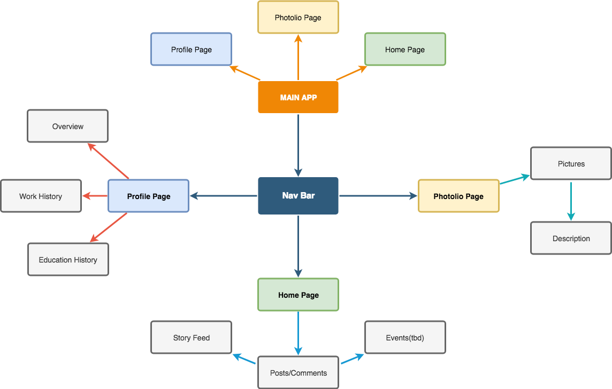

# CAPSTONE 

#### A blog website that involves UX and UI with stylish designs

#### By **Mark Mangahas**

## Description

A website that allows the users to comment, view and browse through the blog website. Also this can give other web devs to gain ideas on how to style and design their websites.  

### Project Structure

 

## Setup/Installation Requirements

1. Clone this repository.
2. Run `npm install` in the terminal.
3. Run `ng serve` in the terminal.
4. Check 'https://localhost:4020'

## Notes
  If there are bugs within the my codes, please let me know. 
  Thanks in advance! ;)
  

## Known Bugs
* None at the moment

## Technologies Used
* Angular
* Firebase
* CSS
* W3 CSS Bootstrap
* Typescript
* Webpack
* ESLint

## Support and Contact Details

_Email mo.mangahas@gmail.com._

### License

*MIT*

Copyright (c) 2018 **_Mark Mangahas_**
